# Atlas de actividades por caso de uso

Versión 0.3.0 · 15 de octubre de 2026. Modelos TO-BE, sin validación en campo.

Cada gráfico complementa el flujo y las excepciones de [casos de uso](10-casos-de-uso-e-historias.md). Las líneas discontinuas remiten a alternativas que se evalúan en el paso pertinente, no a tareas obligatorias después del final. Estos son diagramas de actividad representados en Mermaid; no se denominan BPMN ni diagramas UML de casos de uso.

## CU-001 — Acceder y operar con seguimiento

Actor: Usuario.

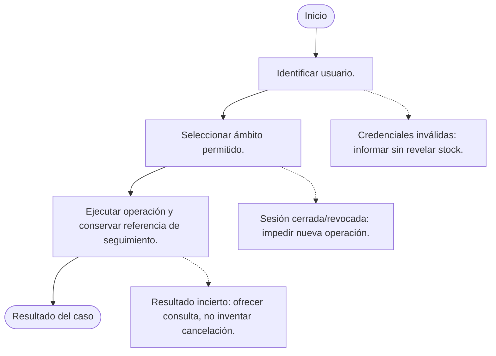
```mermaid
flowchart TD
    S(["Inicio"])
    N0["Identificar usuario."]
    S --> N0
    N1["Seleccionar ámbito permitido."]
    N0 --> N1
    N2["Ejecutar operación y conservar referencia de seguimiento."]
    N1 --> N2
    N2 --> F(["Resultado del caso"])
    N0 -.-> E0["Credenciales inválidas: informar sin revelar stock."]
    N1 -.-> E1["Sesión cerrada/revocada: impedir nueva operación."]
    N2 -.-> E2["Resultado incierto: ofrecer consulta, no inventar cancelación."]
```

## CU-002 — Administrar identidades y permisos

Actor: Administrador.

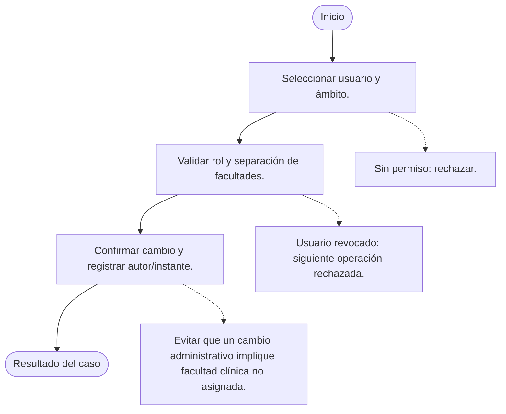
```mermaid
flowchart TD
    S(["Inicio"])
    N0["Seleccionar usuario y ámbito."]
    S --> N0
    N1["Validar rol y separación de facultades."]
    N0 --> N1
    N2["Confirmar cambio y registrar autor/instante."]
    N1 --> N2
    N2 --> F(["Resultado del caso"])
    N0 -.-> E0["Sin permiso: rechazar."]
    N1 -.-> E1["Usuario revocado: siguiente operación rechazada."]
    N2 -.-> E2["Evitar que un cambio administrativo implique facultad clínica no asignada."]
```

## CU-003 — Gestionar establecimientos

Actor: Administrador o responsable de sede.

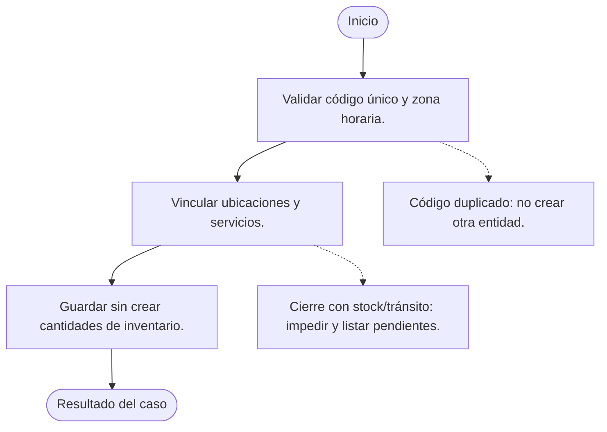
```mermaid
flowchart TD
    S(["Inicio"])
    N0["Validar código único y zona horaria."]
    S --> N0
    N1["Vincular ubicaciones y servicios."]
    N0 --> N1
    N2["Guardar sin crear cantidades de inventario."]
    N1 --> N2
    N2 --> F(["Resultado del caso"])
    N0 -.-> E0["Código duplicado: no crear otra entidad."]
    N1 -.-> E1["Cierre con stock/tránsito: impedir y listar pendientes."]
```

## CU-004 — Mantener catálogo y políticas

Actor: Gestor de catálogo o responsable central.

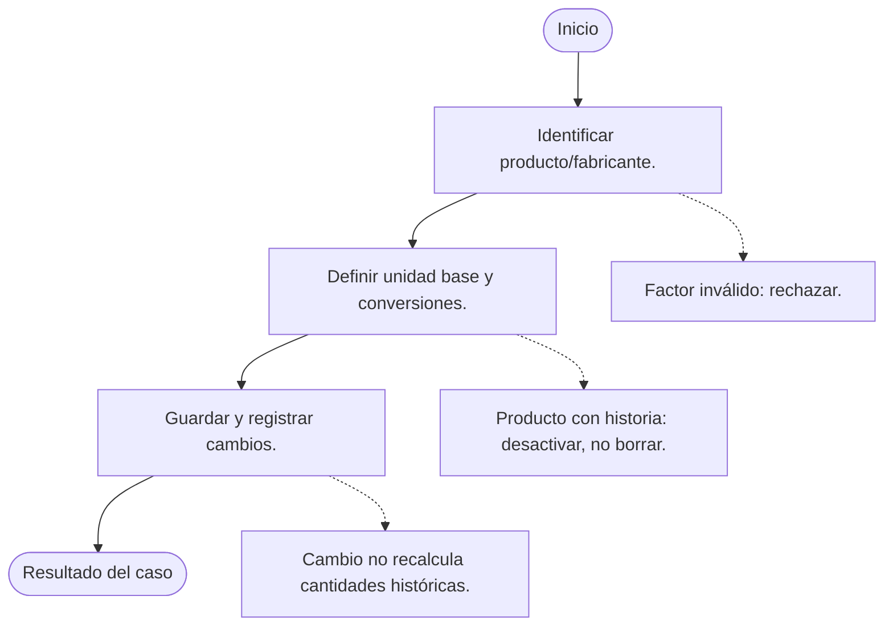
```mermaid
flowchart TD
    S(["Inicio"])
    N0["Identificar producto/fabricante."]
    S --> N0
    N1["Definir unidad base y conversiones."]
    N0 --> N1
    N2["Guardar y registrar cambios."]
    N1 --> N2
    N2 --> F(["Resultado del caso"])
    N0 -.-> E0["Factor inválido: rechazar."]
    N1 -.-> E1["Producto con historia: desactivar, no borrar."]
    N2 -.-> E2["Cambio no recalcula cantidades históricas."]
```

## CU-005 — Recibir productos por lote

Actor: Almacenero autorizado.

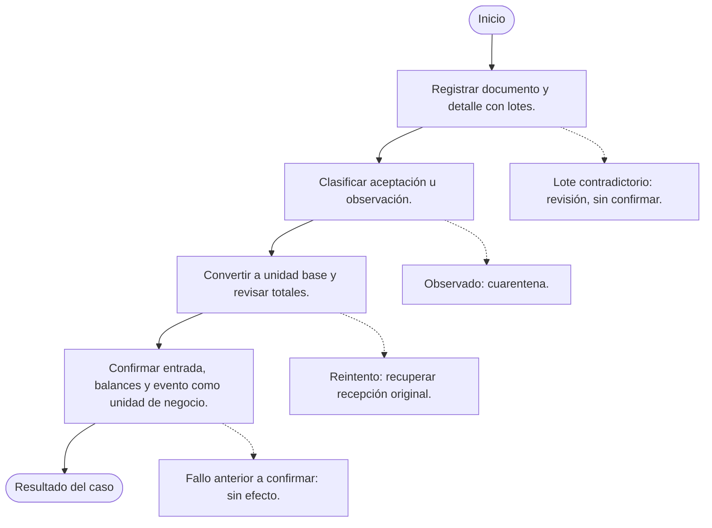
```mermaid
flowchart TD
    S(["Inicio"])
    N0["Registrar documento y detalle con lotes."]
    S --> N0
    N1["Clasificar aceptación u observación."]
    N0 --> N1
    N2["Convertir a unidad base y revisar totales."]
    N1 --> N2
    N3["Confirmar entrada, balances y evento como unidad de negocio."]
    N2 --> N3
    N3 --> F(["Resultado del caso"])
    N0 -.-> E0["Lote contradictorio: revisión, sin confirmar."]
    N1 -.-> E1["Observado: cuarentena."]
    N2 -.-> E2["Reintento: recuperar recepción original."]
    N3 -.-> E3["Fallo anterior a confirmar: sin efecto."]
```

## CU-006 — Consultar stock e historial

Actor: Usuario autorizado.

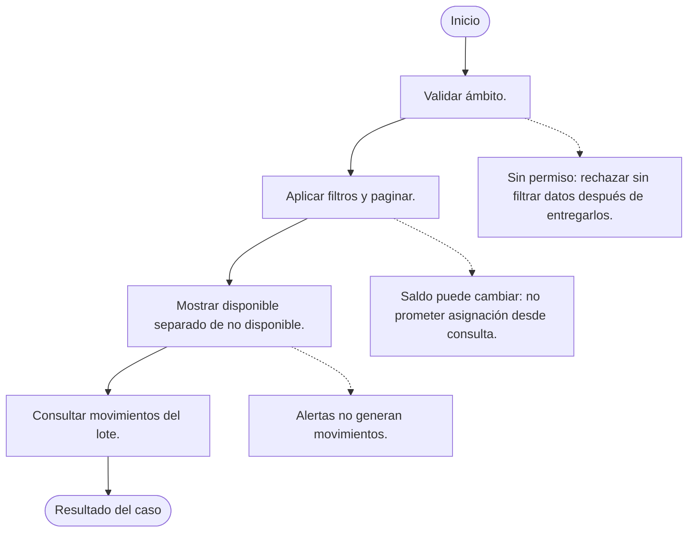
```mermaid
flowchart TD
    S(["Inicio"])
    N0["Validar ámbito."]
    S --> N0
    N1["Aplicar filtros y paginar."]
    N0 --> N1
    N2["Mostrar disponible separado de no disponible."]
    N1 --> N2
    N3["Consultar movimientos del lote."]
    N2 --> N3
    N3 --> F(["Resultado del caso"])
    N0 -.-> E0["Sin permiso: rechazar sin filtrar datos después de entregarlos."]
    N1 -.-> E1["Saldo puede cambiar: no prometer asignación desde consulta."]
    N2 -.-> E2["Alertas no generan movimientos."]
```

## CU-007 — Solicitar insumos al servicio

Actor: Solicitante.

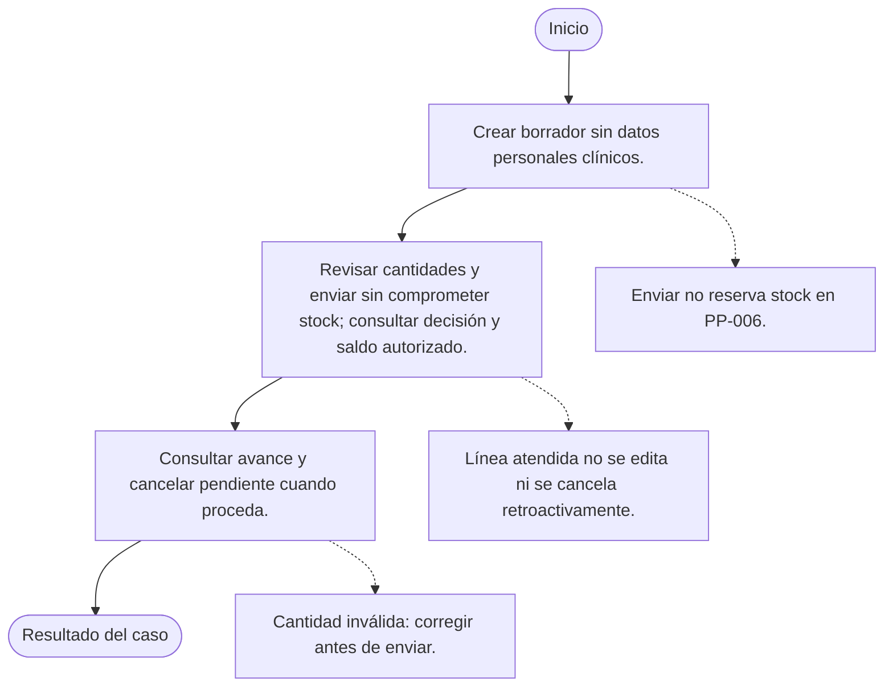
```mermaid
flowchart TD
    S(["Inicio"])
    N0["Crear borrador sin datos personales clínicos."]
    S --> N0
    N1["Revisar cantidades y enviar sin comprometer stock; consultar decisión y saldo autorizado."]
    N0 --> N1
    N2["Consultar avance y cancelar pendiente cuando proceda."]
    N1 --> N2
    N2 --> F(["Resultado del caso"])
    N0 -.-> E0["Enviar no reserva stock en PP-006."]
    N1 -.-> E1["Línea atendida no se edita ni se cancela retroactivamente."]
    N2 -.-> E2["Cantidad inválida: corregir antes de enviar."]
```

## CU-008 — Despachar mediante FEFO

Actor: Farmacia.

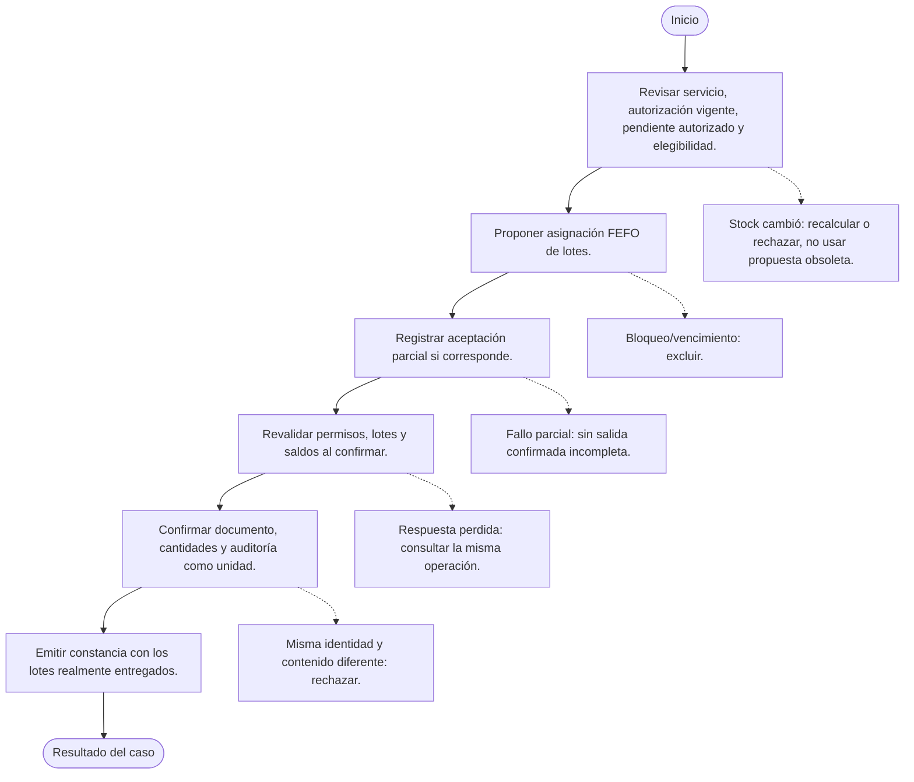
```mermaid
flowchart TD
    S(["Inicio"])
    N0["Revisar servicio, autorización vigente, pendiente autorizado y elegibilidad."]
    S --> N0
    N1["Proponer asignación FEFO de lotes."]
    N0 --> N1
    N2["Registrar aceptación parcial si corresponde."]
    N1 --> N2
    N3["Revalidar permisos, lotes y saldos al confirmar."]
    N2 --> N3
    N4["Confirmar documento, cantidades y auditoría como unidad."]
    N3 --> N4
    N5["Emitir constancia con los lotes realmente entregados."]
    N4 --> N5
    N5 --> F(["Resultado del caso"])
    N0 -.-> E0["Stock cambió: recalcular o rechazar, no usar propuesta obsoleta."]
    N1 -.-> E1["Bloqueo/vencimiento: excluir."]
    N2 -.-> E2["Fallo parcial: sin salida confirmada incompleta."]
    N3 -.-> E3["Respuesta perdida: consultar la misma operación."]
    N4 -.-> E4["Misma identidad y contenido diferente: rechazar."]
```

## CU-009 — Expedir traslado

Actor: Responsable de origen y operador autorizado.

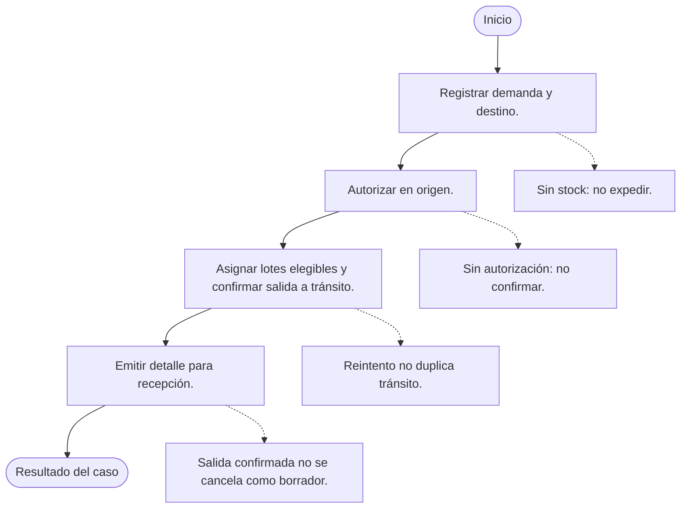
```mermaid
flowchart TD
    S(["Inicio"])
    N0["Registrar demanda y destino."]
    S --> N0
    N1["Autorizar en origen."]
    N0 --> N1
    N2["Asignar lotes elegibles y confirmar salida a tránsito."]
    N1 --> N2
    N3["Emitir detalle para recepción."]
    N2 --> N3
    N3 --> F(["Resultado del caso"])
    N0 -.-> E0["Sin stock: no expedir."]
    N1 -.-> E1["Sin autorización: no confirmar."]
    N2 -.-> E2["Reintento no duplica tránsito."]
    N3 -.-> E3["Salida confirmada no se cancela como borrador."]
```

## CU-010 — Recibir y resolver traslado

Actor: Receptor de destino y responsable autorizado.

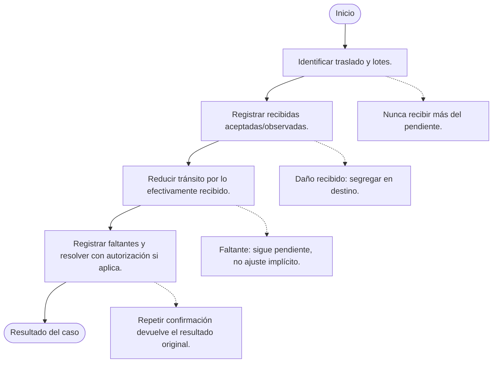
```mermaid
flowchart TD
    S(["Inicio"])
    N0["Identificar traslado y lotes."]
    S --> N0
    N1["Registrar recibidas aceptadas/observadas."]
    N0 --> N1
    N2["Reducir tránsito por lo efectivamente recibido."]
    N1 --> N2
    N3["Registrar faltantes y resolver con autorización si aplica."]
    N2 --> N3
    N3 --> F(["Resultado del caso"])
    N0 -.-> E0["Nunca recibir más del pendiente."]
    N1 -.-> E1["Daño recibido: segregar en destino."]
    N2 -.-> E2["Faltante: sigue pendiente, no ajuste implícito."]
    N3 -.-> E3["Repetir confirmación devuelve el resultado original."]
```

## CU-011 — Recibir y evaluar devolución

Actor: Receptor y responsable farmacéutico.

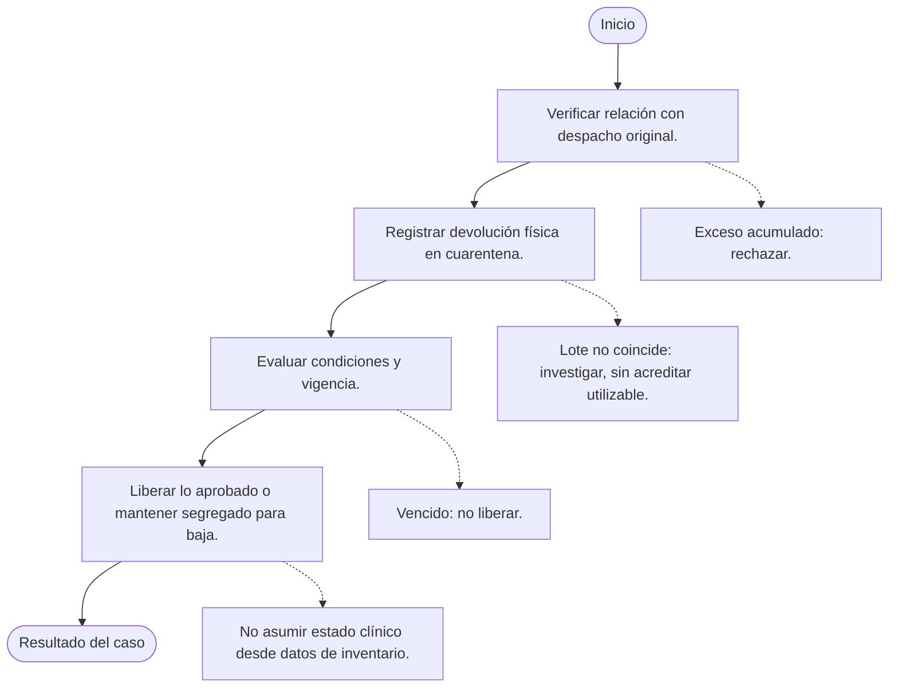
```mermaid
flowchart TD
    S(["Inicio"])
    N0["Verificar relación con despacho original."]
    S --> N0
    N1["Registrar devolución física en cuarentena."]
    N0 --> N1
    N2["Evaluar condiciones y vigencia."]
    N1 --> N2
    N3["Liberar lo aprobado o mantener segregado para baja."]
    N2 --> N3
    N3 --> F(["Resultado del caso"])
    N0 -.-> E0["Exceso acumulado: rechazar."]
    N1 -.-> E1["Lote no coincide: investigar, sin acreditar utilizable."]
    N2 -.-> E2["Vencido: no liberar."]
    N3 -.-> E3["No asumir estado clínico desde datos de inventario."]
```

## CU-012 — Contar y ajustar

Actor: Operador y aprobador distinto.

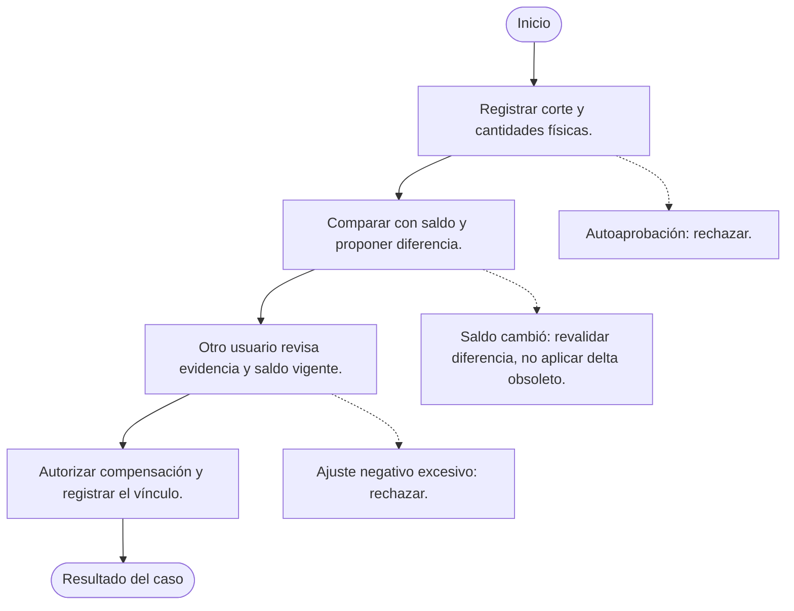
```mermaid
flowchart TD
    S(["Inicio"])
    N0["Registrar corte y cantidades físicas."]
    S --> N0
    N1["Comparar con saldo y proponer diferencia."]
    N0 --> N1
    N2["Otro usuario revisa evidencia y saldo vigente."]
    N1 --> N2
    N3["Autorizar compensación y registrar el vínculo."]
    N2 --> N3
    N3 --> F(["Resultado del caso"])
    N0 -.-> E0["Autoaprobación: rechazar."]
    N1 -.-> E1["Saldo cambió: revalidar diferencia, no aplicar delta obsoleto."]
    N2 -.-> E2["Ajuste negativo excesivo: rechazar."]
```

## CU-013 — Bloquear, liberar o retirar lote

Actor: Responsable farmacéutico/central.

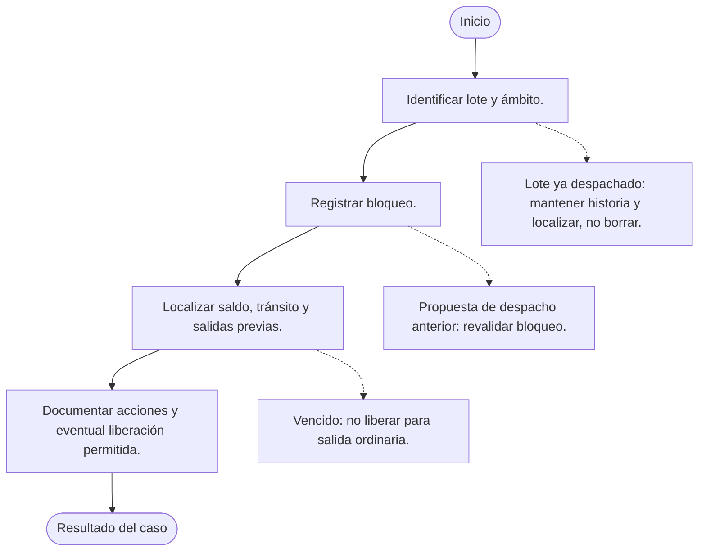
```mermaid
flowchart TD
    S(["Inicio"])
    N0["Identificar lote y ámbito."]
    S --> N0
    N1["Registrar bloqueo."]
    N0 --> N1
    N2["Localizar saldo, tránsito y salidas previas."]
    N1 --> N2
    N3["Documentar acciones y eventual liberación permitida."]
    N2 --> N3
    N3 --> F(["Resultado del caso"])
    N0 -.-> E0["Lote ya despachado: mantener historia y localizar, no borrar."]
    N1 -.-> E1["Propuesta de despacho anterior: revalidar bloqueo."]
    N2 -.-> E2["Vencido: no liberar para salida ordinaria."]
```

## CU-014 — Registrar baja o compensación

Actor: Responsable autorizado.

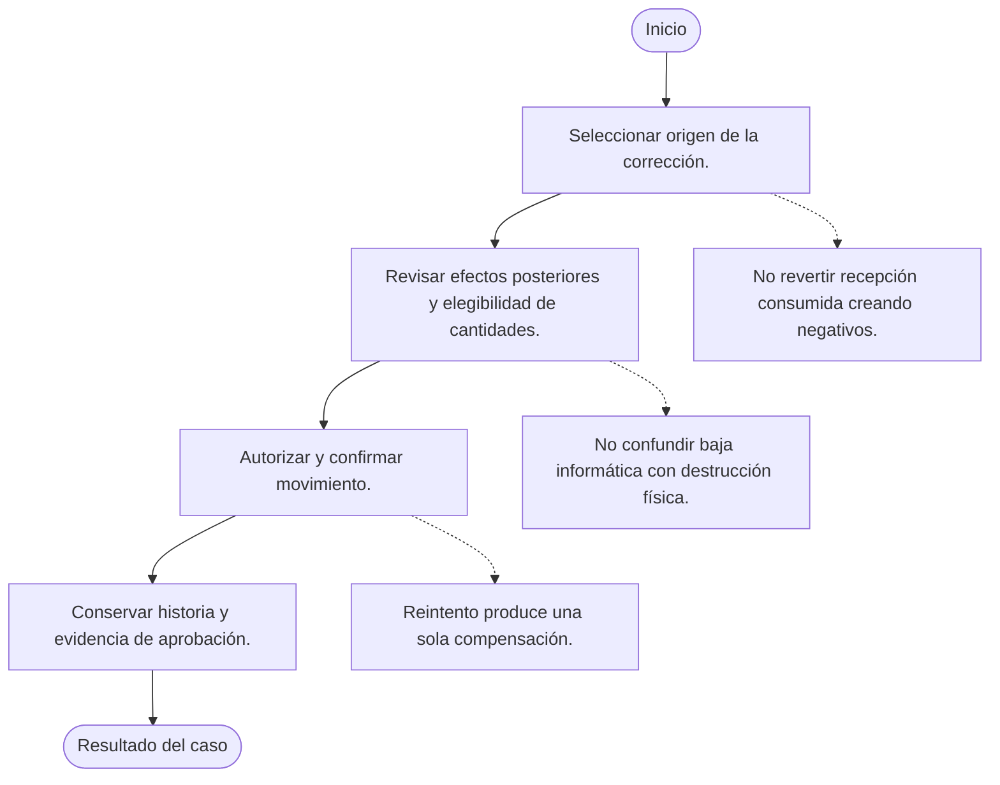
```mermaid
flowchart TD
    S(["Inicio"])
    N0["Seleccionar origen de la corrección."]
    S --> N0
    N1["Revisar efectos posteriores y elegibilidad de cantidades."]
    N0 --> N1
    N2["Autorizar y confirmar movimiento."]
    N1 --> N2
    N3["Conservar historia y evidencia de aprobación."]
    N2 --> N3
    N3 --> F(["Resultado del caso"])
    N0 -.-> E0["No revertir recepción consumida creando negativos."]
    N1 -.-> E1["No confundir baja informática con destrucción física."]
    N2 -.-> E2["Reintento produce una sola compensación."]
```

## CU-015 — Auditar, verificar y conciliar

Actor: Auditor.

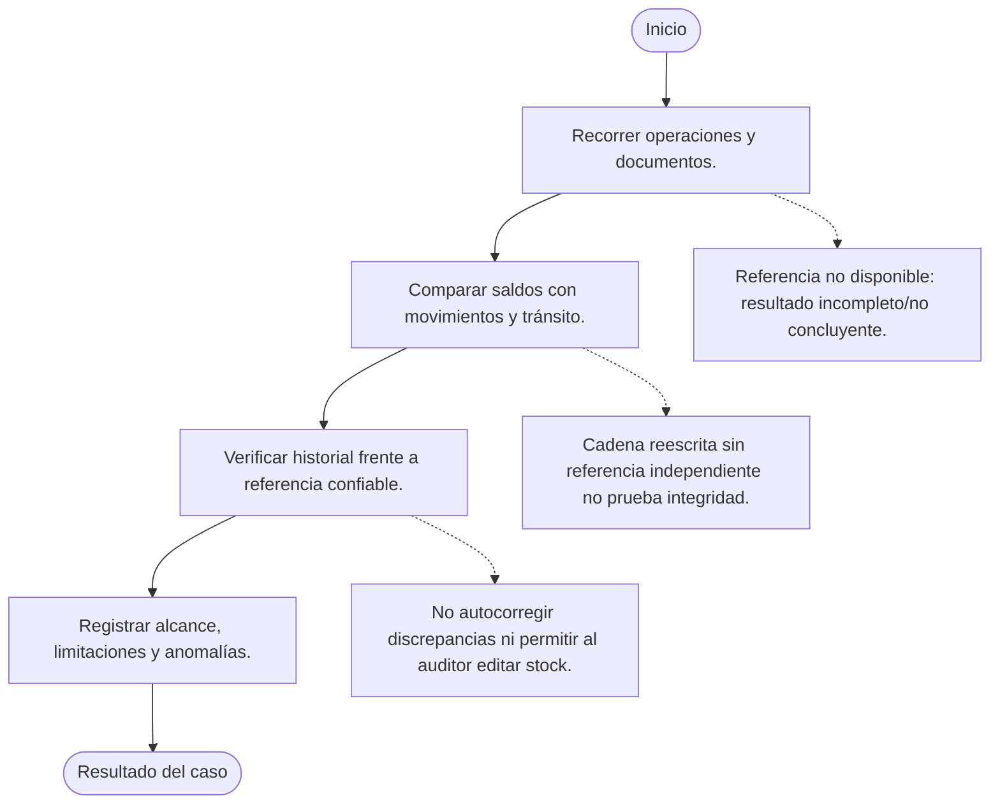
```mermaid
flowchart TD
    S(["Inicio"])
    N0["Recorrer operaciones y documentos."]
    S --> N0
    N1["Comparar saldos con movimientos y tránsito."]
    N0 --> N1
    N2["Verificar historial frente a referencia confiable."]
    N1 --> N2
    N3["Registrar alcance, limitaciones y anomalías."]
    N2 --> N3
    N3 --> F(["Resultado del caso"])
    N0 -.-> E0["Referencia no disponible: resultado incompleto/no concluyente."]
    N1 -.-> E1["Cadena reescrita sin referencia independiente no prueba integridad."]
    N2 -.-> E2["No autocorregir discrepancias ni permitir al auditor editar stock."]
```

## CU-016 — Consolidar y exportar

Actor: Responsable central o auditor.

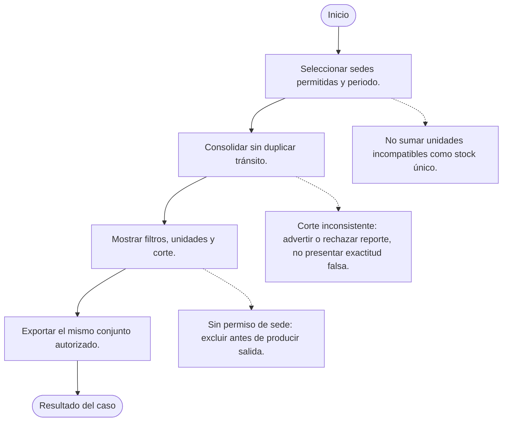
```mermaid
flowchart TD
    S(["Inicio"])
    N0["Seleccionar sedes permitidas y periodo."]
    S --> N0
    N1["Consolidar sin duplicar tránsito."]
    N0 --> N1
    N2["Mostrar filtros, unidades y corte."]
    N1 --> N2
    N3["Exportar el mismo conjunto autorizado."]
    N2 --> N3
    N3 --> F(["Resultado del caso"])
    N0 -.-> E0["No sumar unidades incompatibles como stock único."]
    N1 -.-> E1["Corte inconsistente: advertir o rechazar reporte, no presentar exactitud falsa."]
    N2 -.-> E2["Sin permiso de sede: excluir antes de producir salida."]
```

## CU-017 — Reservar, consumir y liberar cantidades

Actor: Farmacia autorizada; expiración disparada por tiempo operativo.

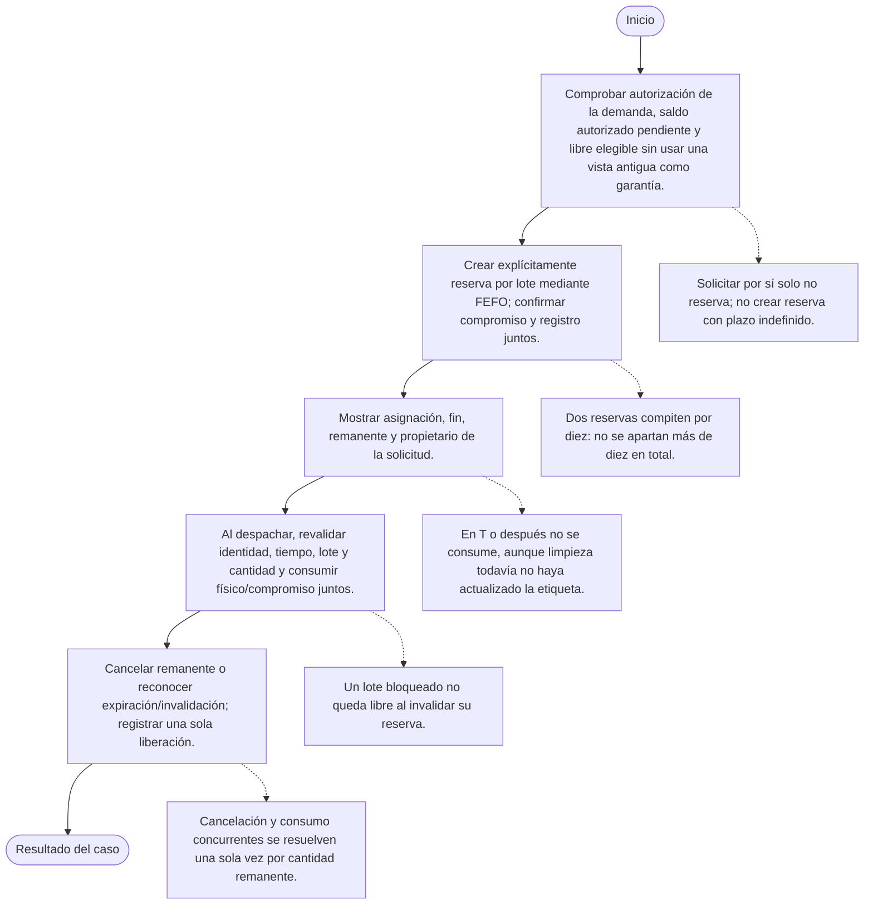
```mermaid
flowchart TD
    S(["Inicio"])
    N0["Comprobar autorización de la demanda, saldo autorizado pendiente y libre elegible sin usar una vista antigua como garantía."]
    S --> N0
    N1["Crear explícitamente reserva por lote mediante FEFO; confirmar compromiso y registro juntos."]
    N0 --> N1
    N2["Mostrar asignación, fin, remanente y propietario de la solicitud."]
    N1 --> N2
    N3["Al despachar, revalidar identidad, tiempo, lote y cantidad y consumir físico/compromiso juntos."]
    N2 --> N3
    N4["Cancelar remanente o reconocer expiración/invalidación; registrar una sola liberación."]
    N3 --> N4
    N4 --> F(["Resultado del caso"])
    N0 -.-> E0["Solicitar por sí solo no reserva; no crear reserva con plazo indefinido."]
    N1 -.-> E1["Dos reservas compiten por diez: no se apartan más de diez en total."]
    N2 -.-> E2["En T o después no se consume, aunque limpieza todavía no haya actualizado la etiqueta."]
    N3 -.-> E3["Un lote bloqueado no queda libre al invalidar su reserva."]
    N4 -.-> E4["Cancelación y consumo concurrentes se resuelven una sola vez por cantidad remanente."]
```

## CU-018 — Interpretar fechas e identificar vencimientos

Actor: Responsable farmacéutico y operador autorizado.

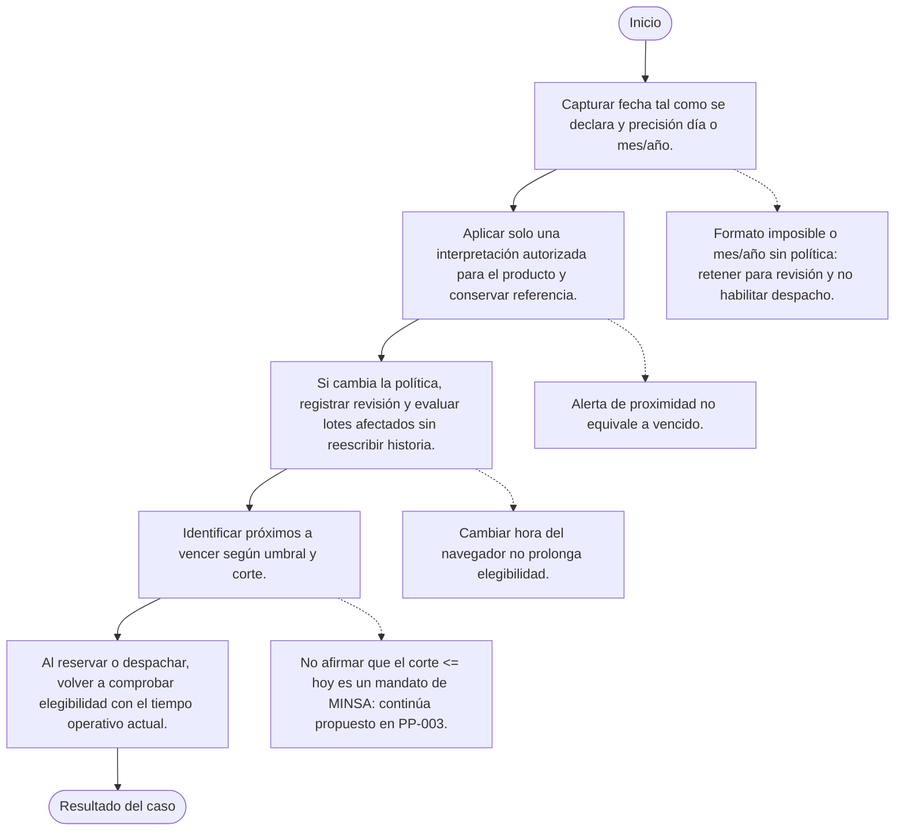
```mermaid
flowchart TD
    S(["Inicio"])
    N0["Capturar fecha tal como se declara y precisión día o mes/año."]
    S --> N0
    N1["Aplicar solo una interpretación autorizada para el producto y conservar referencia."]
    N0 --> N1
    N2["Si cambia la política, registrar revisión y evaluar lotes afectados sin reescribir historia."]
    N1 --> N2
    N3["Identificar próximos a vencer según umbral y corte."]
    N2 --> N3
    N4["Al reservar o despachar, volver a comprobar elegibilidad con el tiempo operativo actual."]
    N3 --> N4
    N4 --> F(["Resultado del caso"])
    N0 -.-> E0["Formato imposible o mes/año sin política: retener para revisión y no habilitar despacho."]
    N1 -.-> E1["Alerta de proximidad no equivale a vencido."]
    N2 -.-> E2["Cambiar hora del navegador no prolonga elegibilidad."]
    N3 -.-> E3["No afirmar que el corte <= hoy es un mandato de MINSA: continúa propuesto en PP-003."]
```

## CU-019 — Solicitar y ejecutar autorizaciones operativas

Actor: Operador solicitante y responsable con permiso específico.

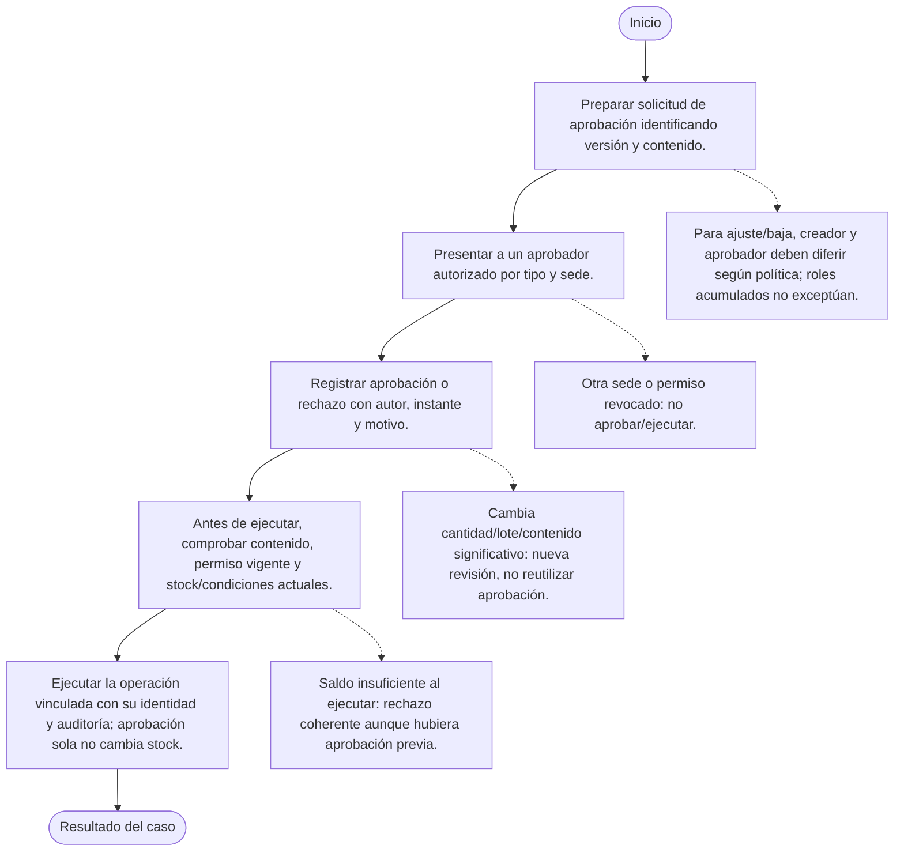
```mermaid
flowchart TD
    S(["Inicio"])
    N0["Preparar solicitud de aprobación identificando versión y contenido."]
    S --> N0
    N1["Presentar a un aprobador autorizado por tipo y sede."]
    N0 --> N1
    N2["Registrar aprobación o rechazo con autor, instante y motivo."]
    N1 --> N2
    N3["Antes de ejecutar, comprobar contenido, permiso vigente y stock/condiciones actuales."]
    N2 --> N3
    N4["Ejecutar la operación vinculada con su identidad y auditoría; aprobación sola no cambia stock."]
    N3 --> N4
    N4 --> F(["Resultado del caso"])
    N0 -.-> E0["Para ajuste/baja, creador y aprobador deben diferir según política; roles acumulados no exceptúan."]
    N1 -.-> E1["Otra sede o permiso revocado: no aprobar/ejecutar."]
    N2 -.-> E2["Cambia cantidad/lote/contenido significativo: nueva revisión, no reutilizar aprobación."]
    N3 -.-> E3["Saldo insuficiente al ejecutar: rechazo coherente aunque hubiera aprobación previa."]
```

## CU-020 — Evaluar riesgo y redistribución

Actor: Responsable de farmacia o cadena.

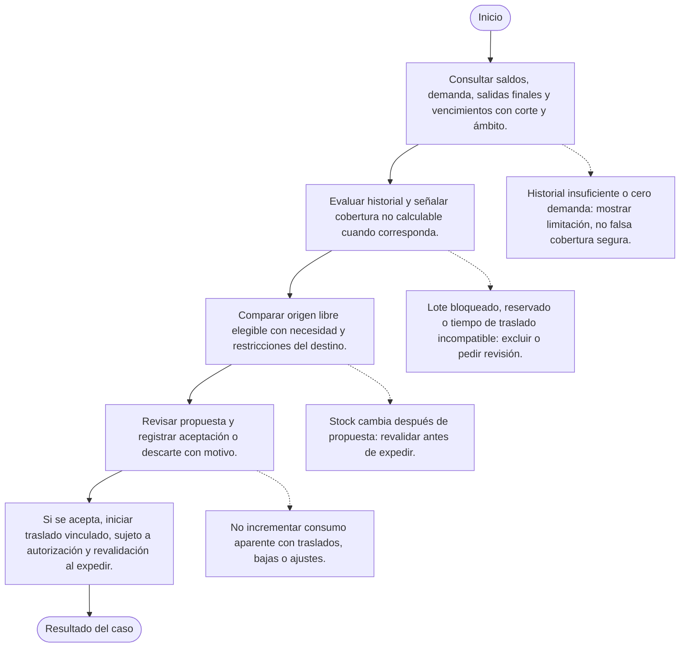
```mermaid
flowchart TD
    S(["Inicio"])
    N0["Consultar saldos, demanda, salidas finales y vencimientos con corte y ámbito."]
    S --> N0
    N1["Evaluar historial y señalar cobertura no calculable cuando corresponda."]
    N0 --> N1
    N2["Comparar origen libre elegible con necesidad y restricciones del destino."]
    N1 --> N2
    N3["Revisar propuesta y registrar aceptación o descarte con motivo."]
    N2 --> N3
    N4["Si se acepta, iniciar traslado vinculado, sujeto a autorización y revalidación al expedir."]
    N3 --> N4
    N4 --> F(["Resultado del caso"])
    N0 -.-> E0["Historial insuficiente o cero demanda: mostrar limitación, no falsa cobertura segura."]
    N1 -.-> E1["Lote bloqueado, reservado o tiempo de traslado incompatible: excluir o pedir revisión."]
    N2 -.-> E2["Stock cambia después de propuesta: revalidar antes de expedir."]
    N3 -.-> E3["No incrementar consumo aparente con traslados, bajas o ajustes."]
```
